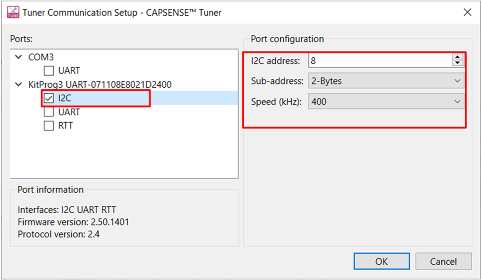
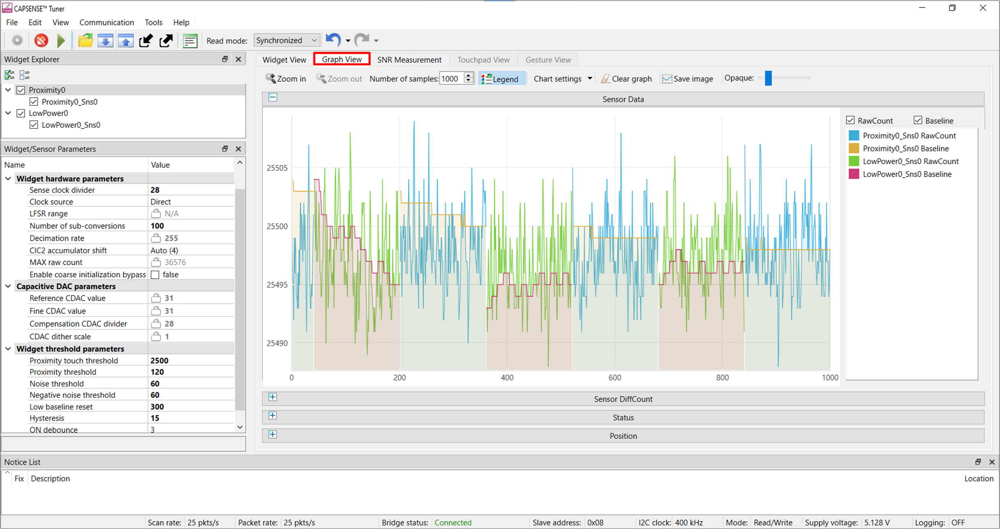
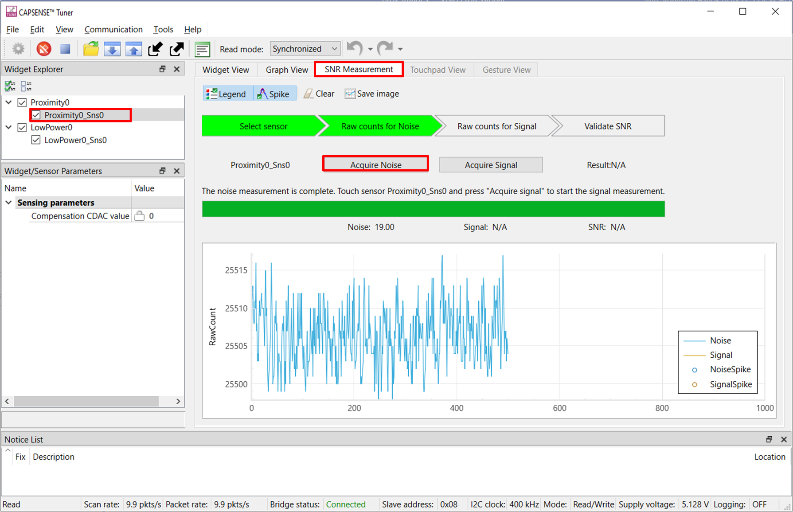
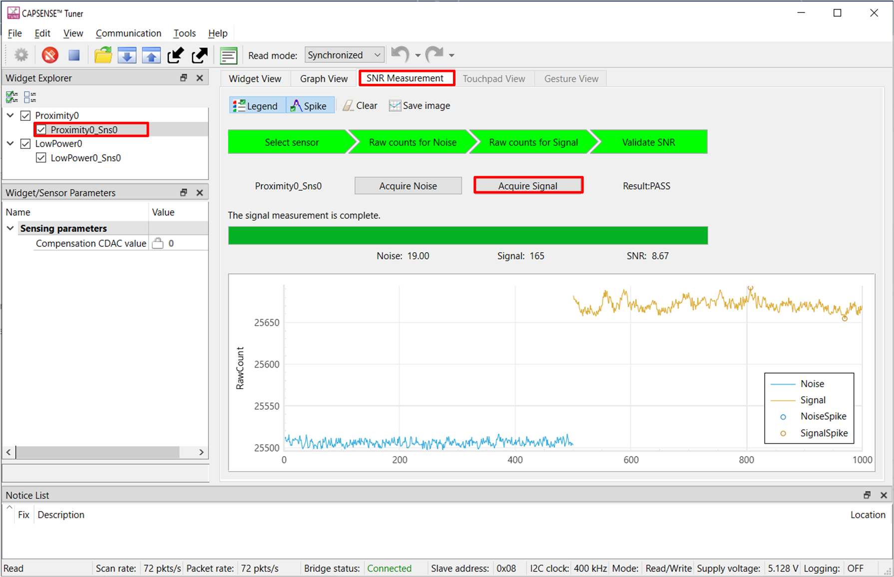
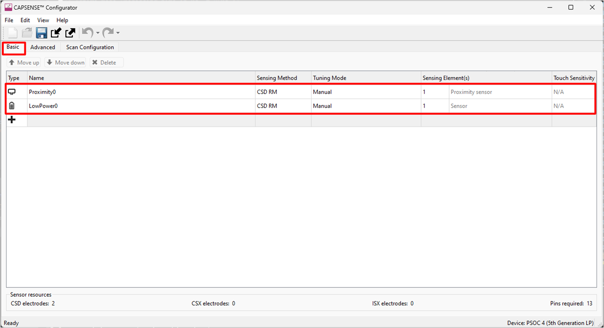
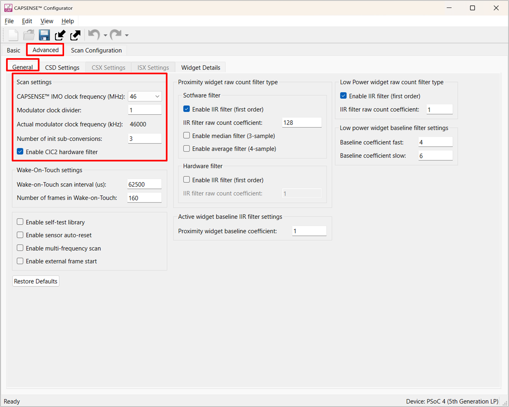
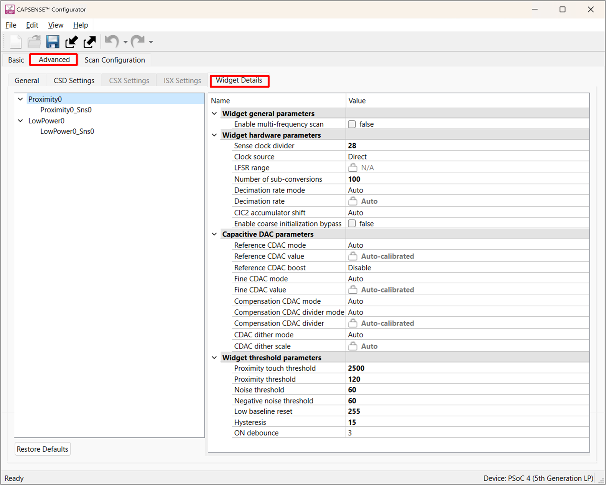
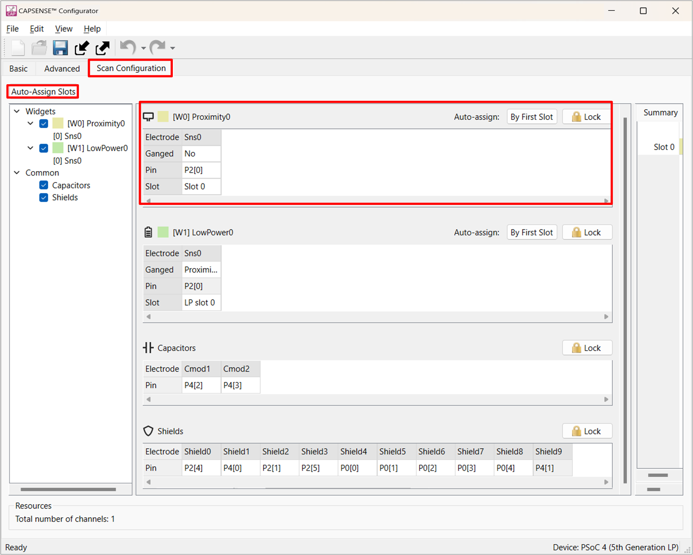
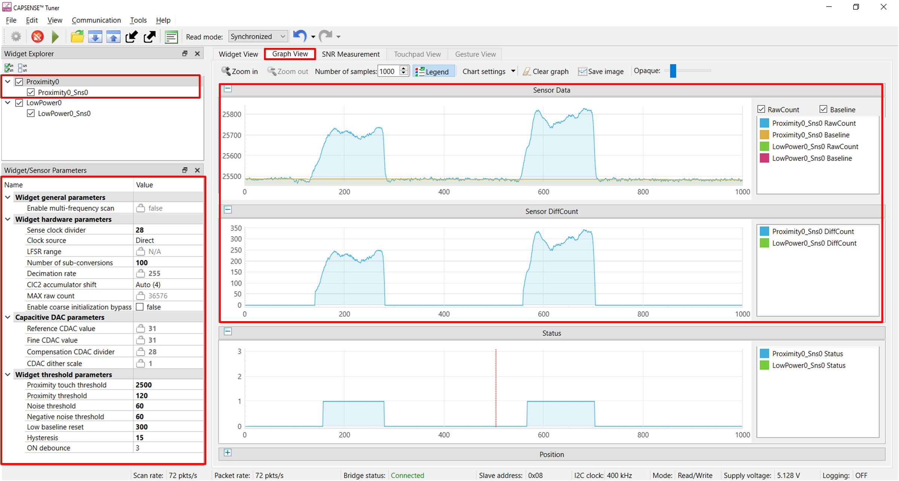
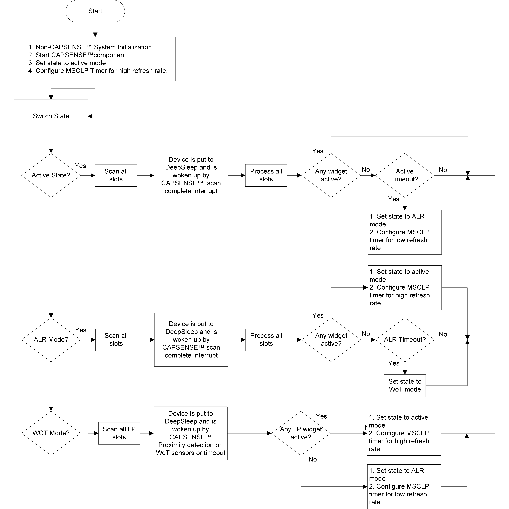

# PSOC&trade; 4: MSCLP low-power proximity

This code example demonstrates an implementation of a low power proximity-sensing application to detect a target (a hand) at a distance. It demonstrates recommended tuning techniques for maximizing proximity sensing range, power consumption and response time. This example uses a 5th-generation low-power CAPSENSE™ (MSCLP) proximity widget, implemented on a PSOC™ 4 based kit.

[View this README on GitHub.](https://github.com/Infineon/mtb-example-psoc4-msclp-low-power-csd-proximity)

[Provide feedback on this code example.](https://cypress.co1.qualtrics.com/jfe/form/SV_1NTns53sK2yiljn?Q_EED=eyJVbmlxdWUgRG9jIElkIjoiQ0UyMzg4ODIiLCJTcGVjIE51bWJlciI6IjAwMi0zODg4MiIsIkRvYyBUaXRsZSI6IlBTT0MmdHJhZGU7IDQ6IE1TQ0xQIGxvdy1wb3dlciBwcm94aW1pdHkiLCJyaWQiOiJsdWNreWwiLCJEb2MgdmVyc2lvbiI6IjQuMC4wIiwiRG9jIExhbmd1YWdlIjoiRW5nbGlzaCIsIkRvYyBEaXZpc2lvbiI6Ik1DRCIsIkRvYyBCVSI6IklDVyIsIkRvYyBGYW1pbHkiOiJQU09DIn0=)


## Requirements

- [ModusToolbox&trade;](https://www.infineon.com/modustoolbox) v3.5 or later 
- Board support package (BSP) minimum required version: 3.3.0
- Programming language: C
- Associated parts: [PSOC&trade; 4000T](https://www.infineon.com/002-33949), [PSOC&trade; 4100T Plus](https://www.infineon.com/002-39671)

## Supported toolchains (make variable 'TOOLCHAIN')

- GNU Arm&reg; Embedded Compiler v11.3.1 (`GCC_ARM`) – Default value of `TOOLCHAIN`
- Arm&reg; Compiler v6.22 (`ARM`)
- IAR C/C++ Compiler v9.50.2 (`IAR`)

## Supported kits (make variable 'TARGET')


- [PSOC&trade; 4000T CAPSENSE&trade; Prototyping Kit](https://www.infineon.com/CY8CPROTO-040T) (`CY8CPROTO-040T`) – Default value of `TARGET`
- [PSOC&trade; 4100T Plus CAPSENSE&trade; Prototyping Kit](https://www.infineon.com/CY8CPROTO-041TP) (`CY8CPROTO-041TP`)

## Hardware setup

This example uses the board's default configuration. See the kit user guide to configure the required operating voltage on the kit and to setup the VDDA supply voltage refer to section [Set up the VDDA supply voltage and debug mode in Device Configurator](#set-up-the-vdda-supply-voltage-and-debug-mode-in-device-configurator).

This application is tuned to perform optimally at the default voltage. However, you can observe the basic functionality at other supported voltages.

**Table 1. Kit user guide and supported voltages**

Kit | User guide  | 1.8 V | 3.3 V | 5 V
:-------- |:----------- |:----------- |:----- |:-----
[CY8CPROTO-040T](https://www.infineon.com/CY8CPROTO-040T) | [PSOC&trade; 4000T CAPSENSE&trade; Prototyping Kit guide](https://www.infineon.com/002-38600) | Yes | Yes | Yes*
[CY8CPROTO-041TP](https://www.infineon.com/CY8CPROTO-041TP) | [PSOC&trade; 4100T Plus CAPSENSE&trade; Prototyping Kit guide](https://www.infineon.com/002-40273) | Yes | Yes | Yes*

Yes* - Kit default operating voltage

   

## Software setup

See the [ModusToolbox&trade; tools package installation guide](https://www.infineon.com/ModusToolboxInstallguide) for information about installing and configuring the tools package.

This example requires no additional software or tools.


## Using the code example

### Create the project

The ModusToolbox&trade; tools package provides the Project Creator as both a GUI tool and a command line tool.

<details><summary><b>Use Project Creator GUI</b></summary>

1. Open the Project Creator GUI tool.

   There are several ways to do this, including launching it from the dashboard or from inside the Eclipse IDE. For more details, see the [Project Creator user guide](https://www.infineon.com/ModusToolboxProjectCreator) (locally available at *{ModusToolbox&trade; install directory}/tools_{version}/project-creator/docs/project-creator.pdf*).

2. On the **Choose Board Support Package (BSP)** page, select a kit supported by this code example. See [Supported kits](#supported-kits-make-variable-target).

   > **Note:** To use this code example for a kit not listed here, you may need to update the source files. If the kit does not have the required resources, the application may not work.

3. On the **Select Application** page:

   a. Select the **Applications(s) Root Path** and the **Target IDE**.

   > **Note:** Depending on how you open the Project Creator tool, these fields may be pre-selected for you.

   b.	Select this code example from the list by enabling its check box.

   > **Note:** You can narrow the list of displayed examples by typing in the filter box.

   c. (Optional) Change the suggested **New Application Name** and **New BSP Name**.

   d. Click **Create** to complete the application creation process.

</details>

<details><summary><b>Use Project Creator CLI</b></summary>

The 'project-creator-cli' tool can be used to create applications from a CLI terminal or from within batch files or shell scripts. This tool is available in the *{ModusToolbox&trade; install directory}/tools_{version}/project-creator/* directory.

Use a CLI terminal to invoke the 'project-creator-cli' tool. On Windows, use the command-line 'modus-shell' program provided in the ModusToolbox&trade; installation instead of a standard Windows command-line application. This shell provides access to all ModusToolbox&trade; tools. You can access it by typing "modus-shell" in the search box in the Windows menu. In Linux and macOS, you can use any terminal application.

The following example clones the "mtb-example-psoc4-msclp-low-power-csd-proximity" application with the desired name "MSCLP_Low_Power_Proximity" configured for the *CY8CPROTO-040T* BSP into the specified working directory, *C:/mtb_projects*:

   ```
   project-creator-cli --board-id CY8CPROTO-040T --app-id mtb-example-psoc4-msclp-low-power-csd-proximity --user-app-name MSCLP_Low_Power_Proximity --target-dir "C:/mtb_projects"
   ```


The 'project-creator-cli' tool has the following arguments:

Argument | Description | Required/optional
---------|-------------|-----------
`--board-id` | Defined in the <id> field of the [BSP](https://github.com/Infineon?q=bsp-manifest&type=&language=&sort=) manifest | Required
`--app-id`   | Defined in the <id> field of the [CE](https://github.com/Infineon?q=ce-manifest&type=&language=&sort=) manifest | Required
`--target-dir`| Specify the directory in which the application is to be created if you prefer not to use the default current working directory | Optional
`--user-app-name`| Specify the name of the application if you prefer to have a name other than the example's default name | Optional

> **Note:** The project-creator-cli tool uses the `git clone` and `make getlibs` commands to fetch the repository and import the required libraries. For details, see the "Project creator tools" section of the [ModusToolbox&trade; tools package user guide](https://www.infineon.com/ModusToolboxUserGuide) (locally available at {ModusToolbox&trade; install directory}/docs_{version}/mtb_user_guide.pdf).

</details>


### Open the project

After the project has been created, you can open it in your preferred development environment.


<details><summary><b>Eclipse IDE</b></summary>

If you opened the Project Creator tool from the included Eclipse IDE, the project will open in Eclipse automatically.

For more details, see the [Eclipse IDE for ModusToolbox&trade; user guide](https://www.infineon.com/MTBEclipseIDEUserGuide) (locally available at *{ModusToolbox&trade; install directory}/docs_{version}/mt_ide_user_guide.pdf*).

</details>


<details><summary><b>Visual Studio (VS) Code</b></summary>

Launch VS Code manually, and then open the generated *{project-name}.code-workspace* file located in the project directory.

For more details, see the [Visual Studio Code for ModusToolbox&trade; user guide](https://www.infineon.com/MTBVSCodeUserGuide) (locally available at *{ModusToolbox&trade; install directory}/docs_{version}/mt_vscode_user_guide.pdf*).

</details>


<details><summary><b>Keil µVision</b></summary>

Double-click the generated *{project-name}.cprj* file to launch the Keil µVision IDE.

For more details, see the [Keil µVision for ModusToolbox&trade; user guide](https://www.infineon.com/MTBuVisionUserGuide) (locally available at *{ModusToolbox&trade; install directory}/docs_{version}/mt_uvision_user_guide.pdf*).

</details>


<details><summary><b>IAR Embedded Workbench</b></summary>

Open IAR Embedded Workbench manually, and create a new project. Then select the generated *{project-name}.ipcf* file located in the project directory.

For more details, see the [IAR Embedded Workbench for ModusToolbox&trade; user guide](https://www.infineon.com/MTBIARUserGuide) (locally available at *{ModusToolbox&trade; install directory}/docs_{version}/mt_iar_user_guide.pdf*).

</details>


<details><summary><b>Command line</b></summary>

If you prefer to use the CLI, open the appropriate terminal, and navigate to the project directory. On Windows, use the command-line 'modus-shell' program; on Linux and macOS, you can use any terminal application. From there, you can run various `make` commands.

For more details, see the [ModusToolbox&trade; tools package user guide](https://www.infineon.com/ModusToolboxUserGuide) (locally available at *{ModusToolbox&trade; install directory}/docs_{version}/mtb_user_guide.pdf*).

</details>


## Operation

1. Connect the board to your PC using a USB cable through the KitProg3 USB connector.

2. Program the board using one of the following:

   <details><summary><b>Using Eclipse IDE</b></summary>

      1. Select the application project in the Project Explorer.

      2. In the **Quick Panel**, scroll down, and click **\<Application Name> Program (KitProg3_MiniProg4)**.
   </details>


   <details><summary><b>In other IDEs</b></summary>

   Follow the instructions in your preferred IDE.
   </details>


   <details><summary><b>Using CLI</b></summary>

     From the terminal, execute the `make program` command to build and program the application using the default toolchain to the default target. The default toolchain is specified in the application's Makefile but you can override this value manually:
      ```
      make program TOOLCHAIN=<toolchain>
      ```

      Example:
      ```
      make program TOOLCHAIN=GCC_ARM
      ```
   </details>

3. After programming, the application starts automatically.

   > **Note:** After programming, you may see the following error message if debug mode is disabled, see Table 11 for the default debug configuration in the supported kits. Ignore the error or enable the debug mode to solve this error.

   ``` c
   "Error: Error connecting Dp: Cannot read IDR"
   ```

4. To test the application, hover a hand over the CAPSENSE&trade; proximity sensor and observe that the LED turns ON (refer **Table 2**) when the hand is within the proximity range and turns OFF when it is out of the proximity range. The LED brightness changes based on the distance of the hand.<br>
The sensor can also detect a touch. When you touch the sensor (outer loop), the LED turns ON and turns OFF when the touch is removed.

   Note that the proximity sensor detects objects from all directions. Implementing directional proximity sensing in an end system presents a significant challenge due to its dependency on various factors, including the overall enclosure design, hardware components, and PCB layout. To achieve directional sensitivity in proximity sensors, position a ground plane at the bottom to reduce sensitivity from below. The ground plane must be placed with some separation from the shield below the proximity sensor as it decreases the sensitivity. The optimal distance varies based on different system factors and necessitates testing on the actual system to determine the best distance.   


   **Figure 1. Hovering the hand on top of the sensor**

   

   <br>

   **Table 2. LED indications and maximum distance of the proximity sensor**

   Scenario  | CY8CPROTO-040T | CY8CPROTO-041TP 
   :------------------| :-----| :-----
   Hand in proximity  | LED2 | LED3 | 
   Touch  | LED3 | LED2 | ON
   Distance(mm) | ~ 40 |  ~ 40
   <br> 

### Monitor data using the Tuner Application

1. Open CAPSENSE&trade; Tuner from the BSP Configurators section in the IDE **Quick Panel**.

   You can also run the CAPSENSE&trade; Tuner application in standalone mode from *{ModusToolbox&trade; install directory}/ModusToolbox/tools_{version}/capsense-configurator/capsense-tuner*. In this case, after opening the application, select **File** > **Open** and open the *design.cycapsense* file of the respective application, which is present in the *{Application root directory}/bsps/TARGET_APP_\<BSP-NAME>/COMPONENT_BSP_DESIGN_MODUS/* folder.

   See the [ModusToolbox&trade; user guide](https://www.infineon.com/ModusToolboxUserGuide) (locally available at *{ModusToolbox&trade; install directory}/docs_{version}/mtb_user_guide.pdf*) for options to open the CAPSENSE&trade; Tuner application using the CLI.

2. Ensure that the kit is in CMSIS-DAP bulk mode (KitProg3 status LED is ON and not blinking). See [Firmware-loader](https://github.com/Infineon/Firmware-loader) to learn how to update the firmware and switch modes in KitProg3.

3. In Tuner Application, click on the **Tuner Communication Setup** icon or select **Tools** > **Tuner Communication Setup**. 

4. In the **Tuner Communication Setup** window, select **I2C** under **KitProg3** and configure as follows:

	- **I2C address:** 8
	- **Sub-address:** 2-Bytes
	- **Speed (kHz):** 400

   These are the same values set in the EZI2C resource.

   **Figure 2. Tuner Communication Setup parameters**

   

5. Click **Connect** or select **Communication** > **Connect** to establish a connection.

   **Figure 3. Establish connection**

   

6. Click **Start** or select **Communication** > **Start** to start data streaming from the device.

   **Figure 4. Start tuner communication**

   

   The **Widget/Sensor Parameters** tab is updated with the parameters configured in the **CAPSENSE&trade; Configurator** window. The tuner displays the data from the sensor in the **Widget View** and **Graph View** tabs.

7. Set the **Read mode** to **Synchronized** mode. Navigate to the **Widget View** tab and observe that the **Proximity0** widget is highlighted in blue color when you touch it.

   **Figure 5. Widget view of the CAPSENSE&trade; Tuner**

   

8. Go to the **Graph View** tab to view the raw count, baseline, difference count, and status for each sensor. Observe that the low-power widget sensor's (**LowPower0_Sns0**) raw count is plotted after the device completes a full-frame scan (or detects a touch) in **WOT** mode and moves to **Active/ALR** mode.

   **Figure 6. Graph view of the CAPSENSE&trade; Tuner**

   

9. See the **Widget/Sensor parameters** section in the CAPSENSE&trade; Tuner window as shown in **Figure 6**.

10. Switch to the **SNR Measurement** tab and verify that the SNR is above 5:1 and the signal count is above 50.

11. Select the **Proximity0** and **Proximity0_Sns0** sensors, and then click **Acquire Noise** as shown in **Figure 7**.
	> **Note:** Because the scan refresh rate is lower in **ALR** mode, it takes more time to acquire noise. Touch the CAPSENSE&trade; proximity loop once before clicking **Acquire Noise** to transition the device to **ACTIVE** mode to complete the measurement faster.

    **Figure 7. CAPSENSE&trade; Tuner - SNR measurement: Acquire noise**

    

12. To acquire the signal, bring your hand near the proximity loop at the proximity detection distance (mentioned in **Table 2**),  and then click **Acquire Signal**.
    Ensure that:
	- The hand remains above the proximity loop as long as the signal acquisition is in progress. 
	-  Check if the SNR is above 5:1 and the signal count is above 50. If not, repeat signal acquisition by lowering the hand, and therefore, getting a higher signal.

    > **Note:** The maximum distance the proximity loop can sense is when the SNR is greater than 5:1 for a particular configuration. [Tuning procedure](#tuning-procedure) section explains how changing the configuration affects the distance and SNR.

    The calculated SNR on this proximity widget is displayed, as **Figure 8** shows.

    **Figure 8. CAPSENSE&trade; Tuner - SNR measurement: Acquire signal**

    

	> **Note:**  Refer to PSOC&trade; 4: MSCLP low-power CSD button CE to observe the power state transitions.Measure current at different power modes section. The Code Example also explains the scan time and process time measurements.

## Tuning procedure


<details><summary><b> Create custom BSP for your board </b></summary>

1. Create a custom BSP for your board with any device by following the steps given in [ModusToolbox&trade; BSP Assistant user guide](https://www.infineon.com/ModusToolboxBSPAssistant). 

2. Open the *design.modus* file from the *{Application root directory}/bsps/TARGET_APP_\<BSP-NAME>/config/* folder obtained in the previous step and enable CAPSENSE&trade; to get the *design.cycapsense* file. CAPSENSE&trade; configuration can be started from scratch as follows:


</details>

The following steps explain the tuning procedure for the proximity loop and the low-power widget.

 **Note:** See the "Manual Tuning" section in the [AN92239 - Proximity sensing with CAPSENSE&trade;](https://www.infineon.com/AN92239) to learn about the considerations for selecting each parameter values. In addition, see the "Low-power widget parameters" section in the [AN234231 - PSoC™ 4 CAPSENSE™ ultra-low-power capacitive sensing techniques](https://www.infineon.com/AN234231) to learn about the considerations for each parameter values specific to low-power widgets.

The tuning flow of the proximity widget is shown in **Figure 9**.

**Figure 9. Proximity widget tuning flow**

   

To tune the low-power widget, see the **Tuning flow** section of the code example PSOC&trade; 4: MSCLP low-power CSD button.

Do the following to tune the proximity widget:

- [Stage 1: Set initial hardware parameters](#stage-1-set-initial-hardware-parameters)

- [Stage 2: Set sense clock frequency](#stage-2-set-sense-clock-frequency)

- [Stage 3: Measure sensor capacitance to set CDAC tuning mode](#stage-3-measure-sensor-capacitance-to-set-cdac-tuning-mode)

- [Stage 4: Fine-tune for required SNR, power, and refresh rate](#stage-4-fine-tune-for-required-snr-power-and-refresh-rate)

- [Stage 5: Tune threshold parameters](#stage-5-tune-threshold-parameters)

### Stage 1: Set initial hardware parameters
-------------------------

1. Connect the board to the PC using a USB cable through the KitProg3 USB connector.

2. Launch the Device Configurator tool.

   Launch the CAPSENSE™ Configurator tool in Eclipse IDE for ModusToolbox™ from the CAPSENSE™ peripheral setting in the Device Configurator or directly from the BSP Configurators section in the IDE Quick Panel.

   Or

   Launch it in standalone mode from {ModusToolbox™ install directory}/ModusToolbox™/tools_{version}/capsense-configurator/capsense-configurator. In this case, after opening the application, select **File** > **Open** and open the design.cycapsense file of the respective application, which is present in the {Application root directory}/bsps/TARGET_APP_\<BSP-NAME>/COMPONENT_BSP_DESIGN_MODUS folder.

3. Enable CAPSENSE&trade; channel in Device Configurator as shown in **Figure 10**.

   **Figure 10. Enable CAPSENSE&trade; in Device Configurator**

   

   Save the changes and close the window.

4. Launch the CAPSENSE&trade; Configurator tool.

   You can launch the **CAPSENSE&trade; Configurator** tool in Eclipse IDE for ModusToolbox&trade; from the CAPSENSE&trade; peripheral setting in the **Device Configurator** or directly from the **BSP Configurators** section in the IDE **Quick Panel**.

   You can also launch it in standalone mode from *{ModusToolbox&trade; install directory}/ModusToolbox&trade;/tools_{version}/capsense-configurator/capsense-configurator*. In this case, after opening the application, select **File** > **Open** and open the *design.cycapsense* file of the respective application, which is present in the *{Application root directory}/bsps/TARGET_APP_\<BSP-NAME>/COMPONENT_BSP_DESIGN_MODUS* folder.

   See the [ModusToolbox&trade; CAPSENSE&trade; Configurator tool guide](https://www.infineon.com/ModusToolboxCapSenseConfig) for step-by-step instructions on how to configure and launch CAPSENSE&trade; in ModusToolbox&trade;.

5. In the **Basic** tab, add a proximity widget **Proximity0** and a low-power widget **LowPower0**. Set their sensing mode as CSD RM (self-cap) and set the **CSD tuning mode** as **Manual tuning**.

   **Figure 11. CAPSENSE&trade; Configurator - Basic tab**

   

6. Do the following in the **General** tab under the **Advanced** tab:

   **Table 3. Widget details**

   Parameter | Setting | Comment
   :-------- |:----------- |:-----------
   CAPSENSE&trade; IMO Clock frequency | 46 | Frequency of clock used as source for the CAPSENSE™ peripheral
   Modulator clock divider | 1 | Set to obtain the optimum modulator clock frequency
   Number of init sub-conversions | 3 | Set to ensure proper initialization of CAPSENSE™.
   Wake-on-Touch scan interval (us) | 62500 |It is set based on the required low-power state scan refresh rate. For example, to get a 16-Hz refresh rate, set the value to 62500 
   Number of frames in Wake-on-Touch | 160 |This determines the maximum time the device will be kept in the lowest-power mode (WoT timeout) if there is no user activity. The maximum time can be calculated using **Equation 1**.

   **Equation 1:** 

   


   > **Note:**  For tuning low-power widgets, Number of frames in Wake-on-Touch must be less than the Maximum number of Frames. This is calculated based on the number of sensors in WoT mode and SRAM size. Exceeding this overwrite the previous rawcounts of the frame.

   **Table 4. Maximum number of raw counts values in SRAM**


   Number of low power widgets  | Maximum number of raw counts in SRAM  
   :----------------------------| :-----------------------------------
      1  | 245 |
      2  | 117 |
      3  | 74 |
      4  | 53 |
      5  | 40 |
      6  | 31 |
      7  | 25 |
      8  | 21 |

   <br>

7. Retain the default settings for all regular and low-power widget filters. You can enable or update the filters later depending on the signal-to-noise ratio (SNR) requirements in [Stage 4: Fine-tune for required SNR, power, and refresh rate](#stage-3-fine-tune-for-required-snr-power-and-refresh-rate).

      Filters are used to reduce the peak-to-peak noise; however, using filters will result in a higher scan time.

   **Figure 12. CAPSENSE&trade; Configurator - General settings**

   

   > **Note:** Each tab has a **Restore Defaults** button to restore the parameters of that tab to their default values.

8. Go to the **CSD Settings** tab and make the following changes:

   **Table 5. Scan setting**

   Parameter | CY8CPROTO-040T | CY8CPROTO-041TP |Comment
   :-------- |:----------- |:----------- |:-----------
   Inactive sensor connection | Shield |Shield| Connects the inactive sensors ( configured sensors which are not scanned in a given scan-slot ) to the driven shield.
   Shield mode | Active | Active|The driven shield is a signal that replicates the sensor-switching signal. It helps to reduce sensor parasitic capacitance. 
   Total shield count | 10 |10|  Selects the number of shield electrodes used in the design. Most designs work with one dedicated shield electrode, but some designs require multiple dedicated shield electrodes to ease the PCB layout routing or to minimize the PCB area used for the shield layer.
   Raw count calibration level (%) | 70 |85 | If the sensor raw count saturates (equals max raw count) on touch, reduce the raw count calibration level(%). This will prevent raw count saturation.


   **Figure 13. CAPSENSE&trade; Configurator - Advanced CSD settings**

   

9. Go to the **Widget Details** tab.

   Select **Proximity0** from the left pane and then set the following:

   **Table 6. Initial widget parameter setting**

   Parameter | Setting | Comment
   :-------- |:----------- |:-----------
   Sense clock divider | Default | Value will be set in [Stage 2:  Set sense clock frequency](#stage-2-set-sense-clock-frequency)
   Clock source | Direct | Direct clock is a constant frequency sense clock source. When you chose this option, the sensor pin switches with a constant frequency
   Number of sub-conversions | 60 | Good starting point to ensure a fast scan time and sufficient signal. This value will be adjusted as required in [Stage 4: Fine-tune for required SNR, power, and refresh rate](#stage-3-fine-tune-for-required-snr-power-and-refresh-rate)
   Proximity threshold | 65535 |It is set to the maximum to avoid waking the device up from WoT mode because of touch detection; this is required to find the signal and SNR. This will be adjusted in [Stage 5: Tune threshold parameters](#stage-4-tune-threshold-parameters)
   Touch threshold | 65535 |It is also set to the maximum to avoid the waking up of the device from WoT mode.
   Noise threshold |60 |Baseline is not updated when raw count is above baseline + Noise threshold.
   Negative noise threshold |60 |Baseline is not updated when raw count is below baseline - Negative noise threshold.
   Low baseline reset | 255 |If raw count is lower than the Negative Noise Threshold for this many samples, baseline is reset to current raw count.
   Hysteresis | 15 |Prevents sensor status toggling due to system noise.
   ON debounce | 3 |Number of consecutive scans during which a sensor must be active so that a touch is reported.

   **Figure 14. CAPSENSE&trade; Configurator - Proximity Widget Details tab under the Advanced tab**

   

10. Go to the **Scan Configuration** tab to select the pins and scan slots. Do the following:

      1. Configure the pins for electrodes using the drop-down menu.

      2. Configure the scan slot using the **Auto-Assign Slots** option or enter a slot number for each each sensor. 

      3. Select Proximity0_Sns0 as **Ganged** under the **LowPower0** widget as shown in **Figure 15**.

      4. Check the notice list for warnings or errors.

         **Figure 15. Scan Configuration tab**

         

11. Click **Save** to apply the settings.

      See the [CAPSENSE&trade; design guide](https://www.infineon.com/AN85951) for detailed information on tuning parameters.

### Stage 2: Set sense clock frequency
-------------------------
The sense clock is derived from the modulator clock using a sense clock-divider and is used to scan the sensor by driving the CAPSENSE&trade; switched capacitor circuits. Both the clock source and clock divider are configurable. The sense clock divider should be configured such that the pulse width of the sense clock is long enough to allow the sensor capacitance to charge and discharge completely. This is verified by observing the charging and discharging waveforms of the sensor using an oscilloscope and an active probe. The sensors should be probed close to the electrode and not at the sense pins or the series resistor. 

See **Figure 16** and **Figure 17** for waveforms observed on the shield. **Figure 16** shows proper charging when the sense clock frequency is correctly tuned. The pulse width is at least 5 Tau, i.e., the voltage is reaching at least 99.3% of the required voltage at the end of each phase. **Figure 17** shows incomplete settling (charging/discharging).


   **Figure 16. Proper charge cycle of a sensor**

   


   **Figure 17. Improper charge cycle of a sensor**

   
   
   To set the proper sense clock frequency, follow these steps:

   1. Program the board and launch CAPSENSE&trade; Tuner.

   2. Observe the charging waveform of the sensor and shield as described earlier. 

   3. If the charging is incomplete, increase the sense clock divider. Do this in CAPSENSE&trade; Tuner by selecting the sensor and editing the sense clock divider parameter in the **Widget/Sensor Parameters** panel.

       > **Note:** 
       > - The sense clock divider should be **divisible by 4**. This ensures that all four scan phases have equal durations. 
       > - After editing the value, click the **Apply to Device** button and observe the waveform again. Repeat this until complete settling is observed.  
       > - Using a passive probe will add an additional parasitic capacitance of around 15 pF; therefore, should be considered during the tuning.
      
   4. Click the **Apply to Project** button so that the configuration is saved to your project. 

      **Figure 18. Sense clock divider setting**

      
      

   5. Repeat this process for all the sensors and the shield. Each sensor may require a different sense clock divider value to charge/discharge completely. But all the sensors which are in the same scan slot need to have the same sense clock source, sense clock divider, and number of sub-conversions. Therefore, take the largest sense clock divider in a given scan slot and apply it to all the other sensors that share that slot.

      **Table 7. Sense clock divider settings obtained for supported kits**

      Parameter |CY8CPROTO-040T|CY8CPROTO-041TP
      :-------- |:----------- |:-----------
      Sense clock divider | 28  |20
      
      <br>

### **Stage 3: Measure sensor capacitance to set CDAC tuning mode**
------------

Generally CDAC tuning mode is recommended to be set to Auto, however the appropriate tuning mode to use has some dependency on the sensor parasitic capacitance (Cp).
 
 
In order to avoid signal variation across devices in production, PSOC 4100T Plus devices have CDAC trim codes in SFLASH (read-only). This code is used to scale the Reference CDAC and Fine CDAC parameters, which compensates for variations in the CDAC and brings down the overall signal variation across units.

This trimming is applicable only in the following scenarios,
- Only for CSD widgets (Regular and Low power).
- Sensor Cp is less than 4pF.
- Reference CDAC and Fine CDAC are set to 'Manual' mode.


   >   **Note:** 
   Select CDAC tuning mode 'Auto', if sensor Cp is above 4pF. Also for sensing methods other than CSD.

>  **Note:** To determine the applicable CDAC tuning mode for configuration in this code example, measure the sensor parasitic capacitance (Cp). If Cp is less than 4pF, reference CDAC and fine CDAC should be configured to 'Manual' mode. Refer to the [PSOC&trade; 4: MSCLP low-power self-capacitance button](https://github.com/Infineon/mtb-example-psoc4-msclp-low-power-csd-button) code example for the procedure to measure Cp and for the steps to configure the CDACs manually.


### Stage 4: Fine-tune for required SNR, power, and refresh rate
-------------------------
The sensor should be tuned to have a minimum SNR of 5:1 and a minimum signal of 50 to ensure reliable operation. The sensitivity can be increased by increasing number of sub-conversions and noise can be decreased by enabling available filters. 

The steps for optimizing these parameters are as follows:

1. Measure the SNR as mentioned in the [Operation](#operation) section.

2. If the SNR is less than 5:1 increase the number of sub-conversions. Edit the number of sub-conversions (N<sub>sub</sub>) directly in the **Widget/Sensor parameters** tab of the CAPSENSE&trade; Tuner.

   **Note:** Number of sub-conversion should be greater than or equal to 8.

3. PSOC&trade; 4 CAPSENSE&trade; devices with MSCLP have a built-in CIC2 filter. wEnabling the CIC2 filter increases the resolution while maintaining the same scan time.

4.  Load the parameters to the device and measure SNR as mentioned in steps 10 and 11 in the [Monitor data using the Tuner Application](#monitor-data-using-the-tuner-application) section. 
   
      Repeat steps 1 to 4 until the following conditions are met:

      - Measured SNR from the previous stage is greater than 5:1

      - Signal count is greater than 50

5. If the system is noisy (>40% of signal), enable filters.

   Whenever the CIC2 filter is enabled, it is recommended to enable the IIR filter for optimal noise reduction. Therefore, this example has the IIR filter enabled as well.

   To enable and configure filters available in the system:

   a. Open **CAPSENSE&trade; Configurator** from ModusToolbox&trade; **Quick Panel** and select the appropriate filter.

      **Figure 19. Filter settings in CAPSENSE&trade; Configurator**

      

      > **Note** : Enable the filter based on the type of noise in your system. For Filter Descriptions refer to **Table 8** and See [AN85951 – PSOC&trade; 4 and PSOC&trade; 6 MCU CAPSENSE&trade; design guide](https://www.infineon.com/AN85951) for more details.

      **Table 8. Filters Description**

      Filter   | Description
      :---------------------| :----------------- 
      Median  | Eliminates noise spikes from motors and switching power supplies
      Average  | Eliminates periodic noise (for example, from power supplies)
      First Order IIR | Software filter which eliminates high frequency Noise, Low coefficient results in lower noise but slows down response. 
      Hardware IIR | Eliminate high frequency Noise, Low coefficient means lower filtering, while higher response time.


   b. Click **Save** and close CAPSENSE&trade; Configurator. Program the device to update the filter settings.

    > **Note** : Increasing number of sub-conversions and enabling filters increases the scan time which in turn decreases the responsiveness of the sensor. Increase in scan time also increases the power consumption. Therefore, the number of sub-conversions and filter configuration must be optimized to achieve a balance between SNR, power, and refresh rate. 

### Stage 5: Tune threshold parameters
-------------------------
Various thresholds, relative to the signal, need to be set for each sensor. Do the following in CAPSENSE&trade; Tuner to set up the thresholds for a widget:

1. Switch to the **Graph View** tab and select **Proximity0**.

2. Place your hand at maximum distance of the proximity sensor as mentioned in **Table 2** directly above the proximity sensor and monitor the touch signal in the **Sensor signal** graph, as shown in **Figure 20**. 

   **Figure 20. Sensor signal when hand is in the proximity of the sensor**

   

3. Note the signal measured for required proximity distance and for touch. The respective signals observed for supported kits is shown in **Table 9**. Set the thresholds according to the recommendations given in **Table 10**:.

      **Table 9. Measured signal**

      Parameter   | Proximity0 (CY8CPROTO-040T) | Proximity0 (CY8CPROTO-041TP)
      :---------------------|  :-----| :-----|
      Proximity signal  |150 | 187 |
      Touch signal  |3125 | 4700  |


      **Table 10. Settings for parameters related to touch/proximity detection**

      Parameter  | CY8CPROTO-040T |  CY8CPROTO-041TP | Remark 
      :---------------------| :-----| :-----| :-----|
      Proximity threshold | 120 |150| 80% of the proximity signal 
      Proximity touch threshold | 2500|3760 | 80% of the touch signal 
      Noise threshold  | 60|75| 40% of the proximity signal 
      Negative noise threshold  | 60|75 | 40% of the proximity signal 
      Hysteresis  | 15| 15| 10% of proximity signal 
      Low baseline reset  | 255| | 30 (by default) 
      ON debounce  | 3 | 3|Default

      Here, the proximity touch threshold denotes the threshold for the proximity sensor to detect a touch when it is touched by a finger. When the proximity sensor is touched, the sensor yields a higher signal compared the proximity signal; therefore, it is the **touch signal**. To measure the touch signal count, touch the sensor and monitor the signal in the **Sensor signal** graph.

3. Apply the settings to the device by clicking **To device**.

   **Figure 21. Apply settings to device**

   

   If your sensor is tuned correctly, the proximity status changes from `0` to `1` in the **Status** sub-window of the **Graph View** window as **Figure 22** shows. The successful tuning of the proximity sensor is also indicated by LED (refer **Table 2**) in the kit; it turns ON when the hand comes closer than the maximum distance and turns OFF when the hand is moved away from the proximity sensor.

   After touching the proximity loop, a further change in status from `1` to `3` can be observed which indicates a touch.

   **Figure 22. Sensor status in CAPSENSE&trade; Tuner showing proximity and touch status**

   

7. Click **Apply to Project** as shown in **Figure 23**. The change is updated in the *design.cycapsense* file. 
   
   Close **CAPSENSE&trade; Tuner** and launch **CAPSENSE&trade; Configurator**. You should now see all the changes that you made in the CAPSENSE&trade; Tuner reflected in the **CAPSENSE&trade; Configurator**.

   **Figure 23. Apply settings to Project**

   
   
   <br>

   </details>

## Debugging

You can debug this project to step through the code. In the IDE, use the **\<Application Name> Debug (KitProg3_MiniProg4)** configuration in the **Quick Panel**. For details, see the "Program and debug" section in the [Eclipse IDE for ModusToolbox&trade; user guide](https://www.infineon.com/MTBEclipseIDEUserGuide).

To enable the debug option, see the [Setup VDDA and Debug mode](#set-up-the-vdda-supply-voltage-and-debug-mode-in-device-configurator) section. To achieve lower power consumption, it is recommended to disable it when not debugging.

see, **Table 11** for the default debug configuration in the supported kits,

**Table 11. Debug mode option status**

   Kit  | Debug mode 
   :----| :----------
   CY8CPROTO-040T | Disabled
   CY8CPROTO-041TP | Enabled

## Design and implementation

The project contains the following widgets:

1. Proximity widget with 1 electrode configured in CSD-RM Sensing mode.

2. Low power widget with 1 electrode configured in CSD-RM Sensing mode.

See the [Tuning procedure](#tuning-procedure) section for step-by-step instructions on configuring these widgets.

The project uses the [CAPSENSE&trade; middleware](https://infineon.github.io/capsense/capsense_api_reference_manual/html/index.html); see the [ModusToolbox&trade; user guide](https://www.infineon.com/ModusToolboxUserGuide) for more details on selecting a middleware.

See [AN85951 – PSOC&trade; 4 and PSOC&trade; 6 MCU CAPSENSE&trade; design guide](https://www.infineon.com/an85951) for more details of CAPSENSE&trade; features and usage.

The design also has an EZI2C peripheral and a PWM controlled LED. The EZI2C slave peripheral is used to monitor sensor data on a computer using the CAPSENSE&trade; Tuner available in the Eclipse IDE for ModusToolbox&trade; via I2C communication.

The PWM pin is used to control the brightness and ON/OFF operation of the LED. 

The firmware is designed to support the following application states:

- Active state (128 Hz)
- Active low-refresh rate state (32 Hz)
- Wake-on-touch state (16 Hz)

   **Figure 24. Firmware state-machine**

   


The firmware state machine and the operation of the device in four different states are explained in the following steps:

1. Initializes and starts all hardware components after reset.

2. The device starts CAPSENSE&trade; operation in the Active state. In this state, the following steps occur:

   1. The device scans all CAPSENSE&trade; sensors present on the board.

   2. During the ongoing scan operation, the CPU moves to the Deep Sleep state.

      > **Note:**  PWM is not available in Deep Sleep. Hence, with the PWM-based LEDs enabled, the application moves the CPU in to Sleep mode instead of Deep Sleep mode. To achieve the lowest power possible, set the #define ENABLE_PWM_LED macro to (0u) in *main.c*.
      

   3. The interrupt generated on scan completion wakes the CPU which processes the sensor data and transfers the data to CAPSENSE&trade; Tuner through EZI2C.

   4. Turn ON the corresponding LEDs with specific brightness to indicate the specific proximity or touch detection.

      In Active state, a scan of the selected sensors happens with the highest refresh rate.

3. Enter the Active low-refresh rate state when there is no touch or object in proximity detected for a timeout period. In this state, selected sensors are scanned with a lower refresh rate. Because of this, power consumption in the Active low-refresh rate state is lower compared to the Active state. The state machine returns to the Active state if there is touch or object in proximity detected by the sensor.

4. Enter the Wake-on-Touch state when there is no touch or object in proximity detected in Active low-refresh rate state for a timeout period. In this state, the CPU is set to deep sleep, and is not involved in CAPSENSE&trade; operation. This is the lowest power state of the device. In the Wake-on-Touch state, the CAPSENSE&trade; hardware executes the scanning of the selected sensors called "low-power widgets" and processes the scan data for these widgets. If touch is detected, the CAPSENSE&trade; block wakes up the CPU and the device enters to the Active state.

### Set up the VDDA supply voltage and debug mode in Device Configurator

1. Open Device Configurator from the **Quick Panel**.

2. Go to the **System** tab. Select the **Power** resource, and set the VDDA value under **Operating conditions** as shown in **Figure 25**.

   **Figure 25. Setting the VDDA supply in the System tab of Device Configurator**

   

3. See Table 11 for the default debug configuration in the supported kits, Enable debug mode to enable SWD pins as shown in **Figure 26**.

   **Figure 26. Enable debug mode in the System tab of Device Configurator**

   


## Resources and settings


   **Figure 27. EZI2C settings**


<br>

**Figure 28. PWM settings**


<br>

**Table 12. Application resources**

 Resource  |  Alias/object     |    Purpose     
 :------- | :------------    | :------------ 
 SCB (I2C) (PDL) | CYBSP_EZI2C | EZI2C slave driver to communicate with CAPSENSE&trade; Tuner 
 CAPSENSE&trade; | CYBSP_MSC | CAPSENSE&trade; driver to interact with the MSC hardware and interface the CAPSENSE&trade; sensors 
 Digital pin | CYBSP_PWM | To show the proximity operation in the kits

</details>

### Firmware flow

**Figure 29. Firmware flowchart**



<br>

## Related resources

Resources  | Links
-----------|----------------------------------
Application notes  | [AN79953](https://www.infineon.com/AN79953) – Getting started with PSOC&trade; 4 <br> [AN85951](https://www.infineon.com/AN85951) – PSOC&trade; 4 and PSOC&trade; 6 MCU CAPSENSE&trade; design guide <br> [AN234231](https://www.infineon.com/AN234231) – PSOC&trade; 4 CAPSENSE&trade; ultra-low-power capacitive sensing techniques <br> [AN92239](https://www.infineon.com/AN92239) – Proximity sensing with CAPSENSE&trade;
Code examples  | [Using ModusToolbox&trade;](https://github.com/Infineon/Code-Examples-for-ModusToolbox-Software) on GitHub
Device documentation | [PSOC&trade; 4 datasheets](https://www.infineon.com/cms/en/search.html#!view=downloads&term=psoc4&doc_group=Data%20Sheet) <br>[PSOC&trade; 4 technical reference manuals](https://www.infineon.com/cms/en/search.html#!view=downloads&term=psoc4&doc_group=Additional%20Technical%20Information)
Development kits | Select your kits from the [Evaluation board finder](https://www.infineon.com/cms/en/design-support/finder-selection-tools/product-finder/evaluation-board).
Libraries on GitHub  | [mtb-pdl-cat2](https://github.com/Infineon/mtb-pdl-cat2) – PSOC&trade; 4 Peripheral Driver Library (PDL) <br>  
Middleware on GitHub  | [capsense](https://github.com/Infineon/capsense) – CAPSENSE&trade; library and documents <br> [psoc4-middleware](https://github.com/Infineon/modustoolbox-software#libraries) – Links to all PSOC&trade; 4 middleware
Tools  | [ModusToolbox&trade;](https://www.infineon.com/modustoolbox) – ModusToolbox&trade; software is a collection of easy-to-use libraries and tools enabling rapid development with Infineon MCUs for applications ranging from wireless and cloud-connected systems, edge AI/ML, embedded sense and control, to wired USB connectivity using PSOC&trade; Industrial/IoT MCUs, AIROC&trade; Wi-Fi and Bluetooth&reg; connectivity devices, XMC&trade; Industrial MCUs, and EZ-USB&trade;/EZ-PD&trade; wired connectivity controllers. ModusToolbox&trade; incorporates a comprehensive set of BSPs, HAL, libraries, configuration tools, and provides support for industry-standard IDEs to fast-track your embedded application development.

<br>


## Other resources


Infineon provides a wealth of data at [www.infineon.com](https://www.infineon.com) to help you select the right device, and quickly and effectively integrate it into your design.


## Document history

Document title: *CE238882* – *PSOC&trade; 4: MSCLP low-power proximity*

 Version | Description of change
 ------- | ---------------------
 1.0.0   | New code example.
 2.0.0   | Major update to support ModusToolbox&trade; v3.2 and CAPSENSE&trade; Middleware v5.0. This version is not backward compatible with previous versions of ModusToolbox&trade;
 2.1.0   | Added support for CY8CPROTO-041TP Prototyping Kit 
 3.0.0   | Major update to support ModusToolbox&trade; v3.3. This version is not backward compatible with previous versions of ModusToolbox&trade;
 4.0.0   | Major update to support ModusToolbox&trade; v3.5. This version is not backward compatible with previous versions of ModusToolbox&trade;   

 <br>


All referenced product or service names and trademarks are the property of their respective owners.

The Bluetooth&reg; word mark and logos are registered trademarks owned by Bluetooth SIG, Inc., and any use of such marks by Infineon is under license.


---------------------------------------------------------

© Cypress Semiconductor Corporation, 2023. This document is the property of Cypress Semiconductor Corporation, an Infineon Technologies company, and its affiliates ("Cypress").  This document, including any software or firmware included or referenced in this document ("Software"), is owned by Cypress under the intellectual property laws and treaties of the United States and other countries worldwide.  Cypress reserves all rights under such laws and treaties and does not, except as specifically stated in this paragraph, grant any license under its patents, copyrights, trademarks, or other intellectual property rights.  If the Software is not accompanied by a license agreement and you do not otherwise have a written agreement with Cypress governing the use of the Software, then Cypress hereby grants you a personal, non-exclusive, nontransferable license (without the right to sublicense) (1) under its copyright rights in the Software (a) for Software provided in source code form, to modify and reproduce the Software solely for use with Cypress hardware products, only internally within your organization, and (b) to distribute the Software in binary code form externally to end users (either directly or indirectly through resellers and distributors), solely for use on Cypress hardware product units, and (2) under those claims of Cypress's patents that are infringed by the Software (as provided by Cypress, unmodified) to make, use, distribute, and import the Software solely for use with Cypress hardware products.  Any other use, reproduction, modification, translation, or compilation of the Software is prohibited.
<br>
TO THE EXTENT PERMITTED BY APPLICABLE LAW, CYPRESS MAKES NO WARRANTY OF ANY KIND, EXPRESS OR IMPLIED, WITH REGARD TO THIS DOCUMENT OR ANY SOFTWARE OR ACCOMPANYING HARDWARE, INCLUDING, BUT NOT LIMITED TO, THE IMPLIED WARRANTIES OF MERCHANTABILITY AND FITNESS FOR A PARTICULAR PURPOSE.  No computing device can be absolutely secure.  Therefore, despite security measures implemented in Cypress hardware or software products, Cypress shall have no liability arising out of any security breach, such as unauthorized access to or use of a Cypress product. CYPRESS DOES NOT REPRESENT, WARRANT, OR GUARANTEE THAT CYPRESS PRODUCTS, OR SYSTEMS CREATED USING CYPRESS PRODUCTS, WILL BE FREE FROM CORRUPTION, ATTACK, VIRUSES, INTERFERENCE, HACKING, DATA LOSS OR THEFT, OR OTHER SECURITY INTRUSION (collectively, "Security Breach").  Cypress disclaims any liability relating to any Security Breach, and you shall and hereby do release Cypress from any claim, damage, or other liability arising from any Security Breach.  In addition, the products described in these materials may contain design defects or errors known as errata which may cause the product to deviate from published specifications. To the extent permitted by applicable law, Cypress reserves the right to make changes to this document without further notice. Cypress does not assume any liability arising out of the application or use of any product or circuit described in this document. Any information provided in this document, including any sample design information or programming code, is provided only for reference purposes.  It is the responsibility of the user of this document to properly design, program, and test the functionality and safety of any application made of this information and any resulting product.  "High-Risk Device" means any device or system whose failure could cause personal injury, death, or property damage.  Examples of High-Risk Devices are weapons, nuclear installations, surgical implants, and other medical devices.  "Critical Component" means any component of a High-Risk Device whose failure to perform can be reasonably expected to cause, directly or indirectly, the failure of the High-Risk Device, or to affect its safety or effectiveness.  Cypress is not liable, in whole or in part, and you shall and hereby do release Cypress from any claim, damage, or other liability arising from any use of a Cypress product as a Critical Component in a High-Risk Device. You shall indemnify and hold Cypress, including its affiliates, and its directors, officers, employees, agents, distributors, and assigns harmless from and against all claims, costs, damages, and expenses, arising out of any claim, including claims for product liability, personal injury or death, or property damage arising from any use of a Cypress product as a Critical Component in a High-Risk Device. Cypress products are not intended or authorized for use as a Critical Component in any High-Risk Device except to the limited extent that (i) Cypress's published data sheet for the product explicitly states Cypress has qualified the product for use in a specific High-Risk Device, or (ii) Cypress has given you advance written authorization to use the product as a Critical Component in the specific High-Risk Device and you have signed a separate indemnification agreement.
<br>
Cypress, the Cypress logo, and combinations thereof, ModusToolbox, PSoC, CAPSENSE, EZ-USB, F-RAM, and TRAVEO are trademarks or registered trademarks of Cypress or a subsidiary of Cypress in the United States or in other countries. For a more complete list of Cypress trademarks, visit www.infineon.com. Other names and brands may be claimed as property of their respective owners.
